### Dom Heallis 040728287
### Lab 1

# 1. Create workspace

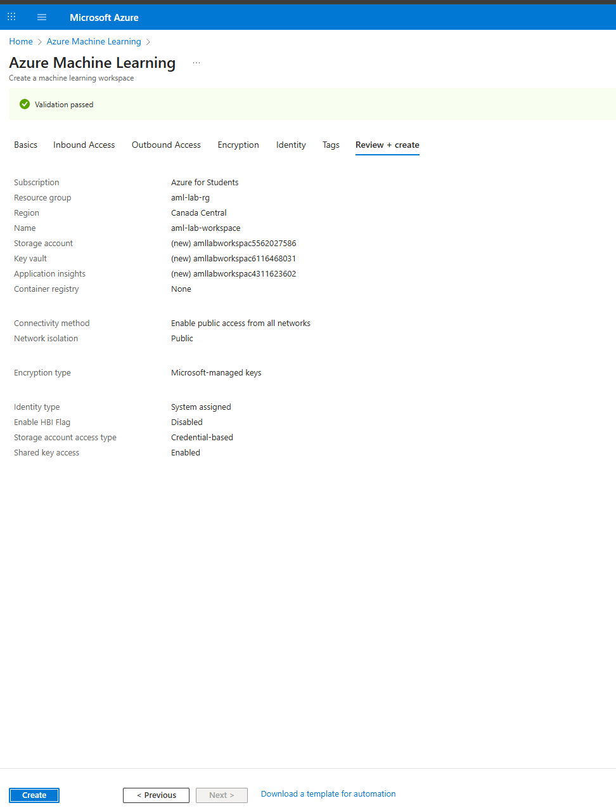

# 2. Create pipeline, changed name, and use automobile price data
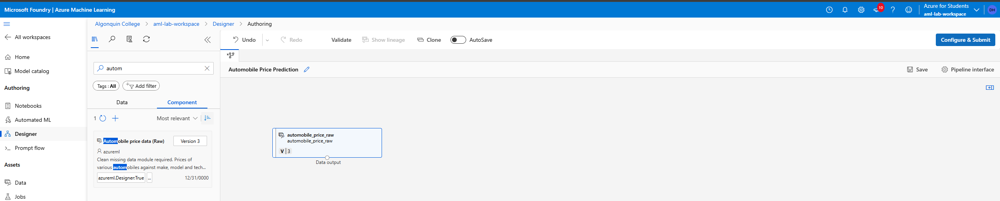

# 3. Configs for new experiement

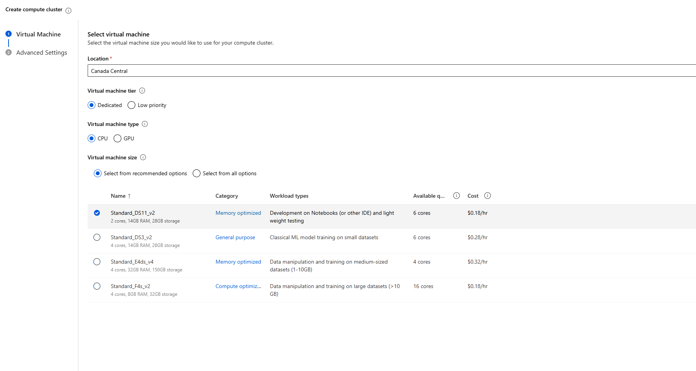

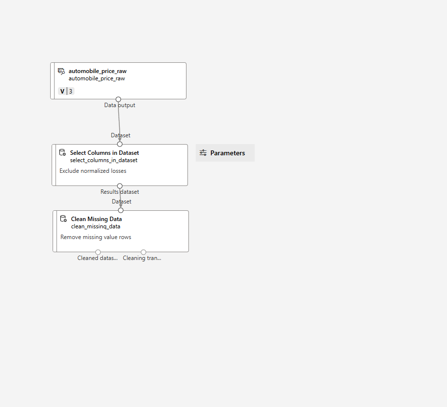

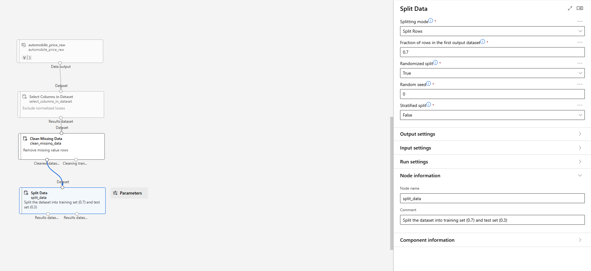

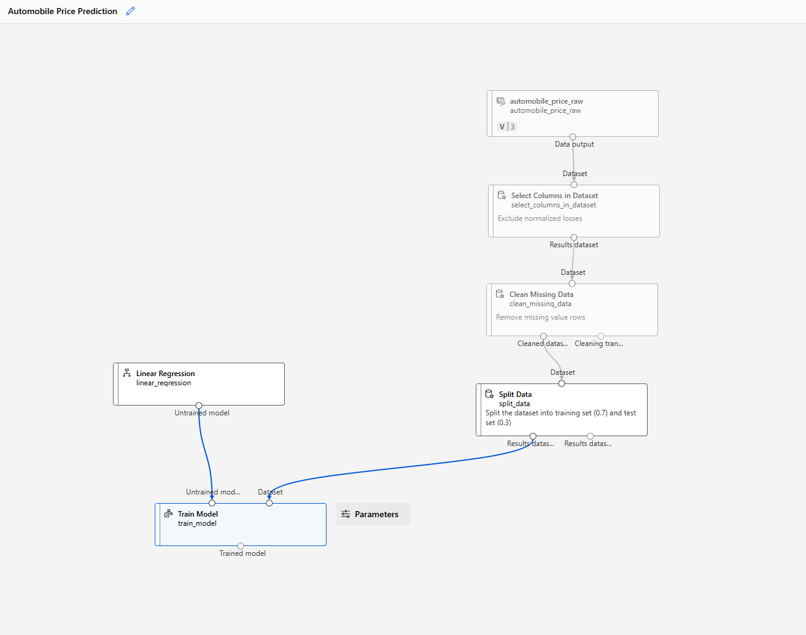

# add the score model component
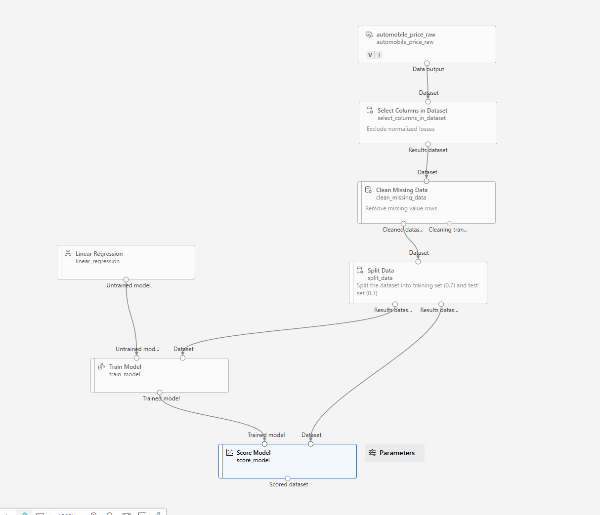

# add The evaluate model component

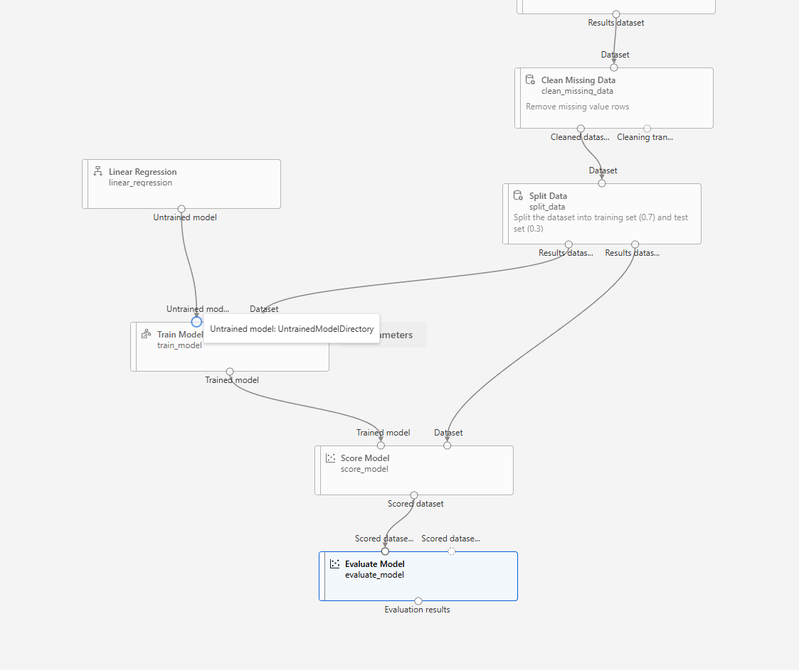

# pipeline successfully running

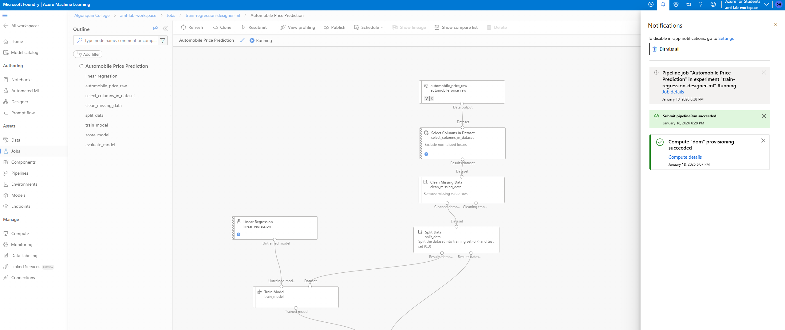

# completed job / data preview

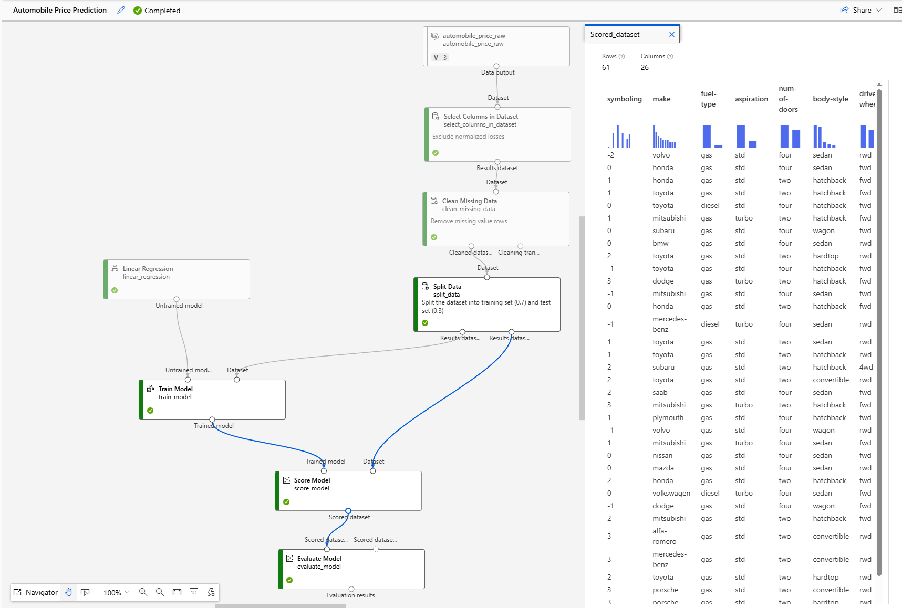

# evaluate model

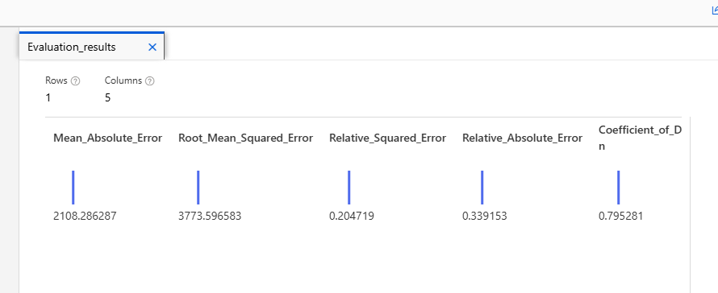

# deleted everything

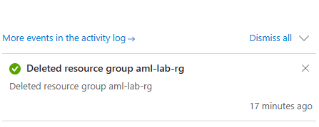