### Dom Heallis 040728287
### Lab 3

# 1. create cosmo db
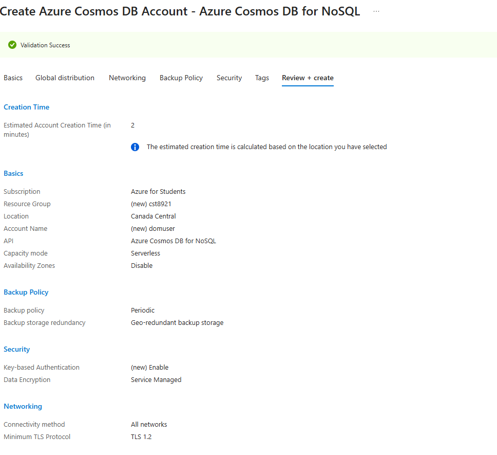

# 2. create container cosmicworks, and enter products for container id, and /categoryid
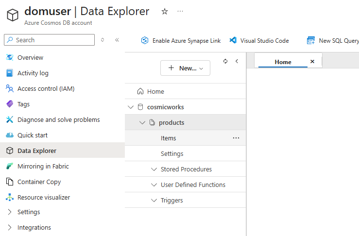

# 3. Create another container, using productslease, /partitionkey
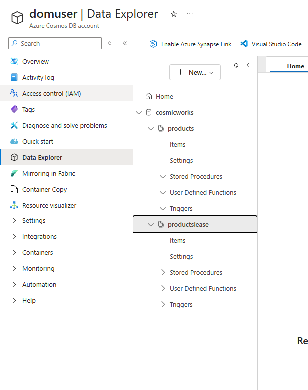

# 4. update endpoint, and cosmos db key
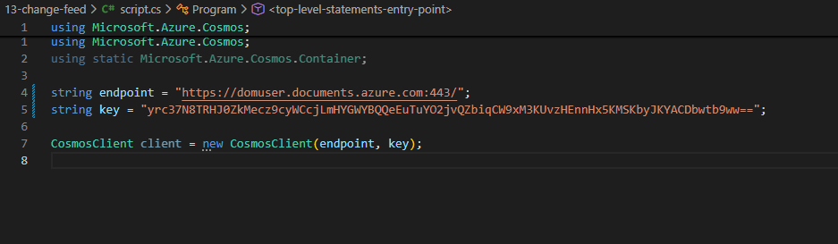

# 5.  updated script.cs
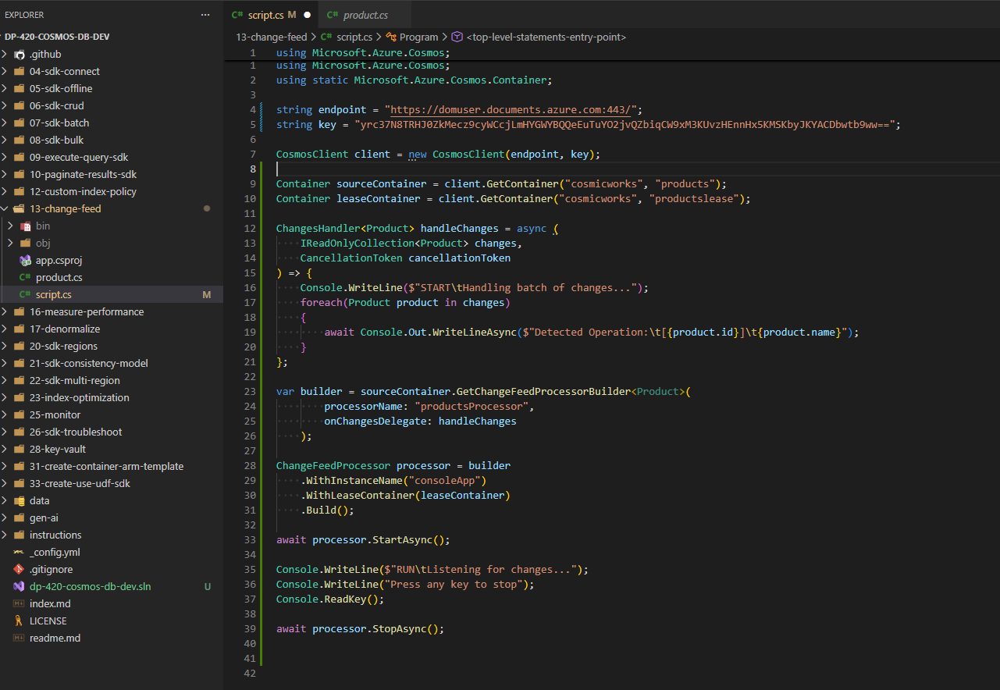

# 6. starting the db
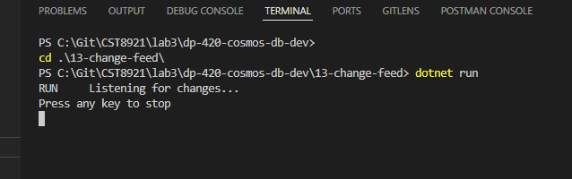

# 7. Seeding db with sample data
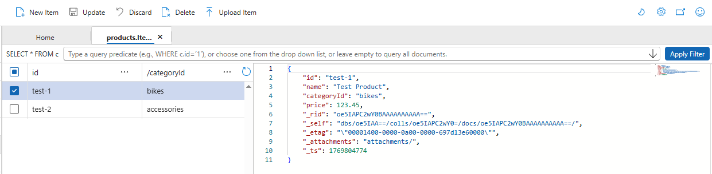
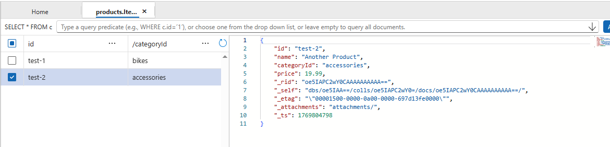

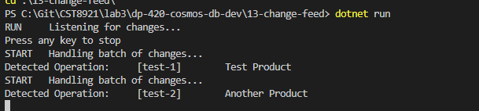

# 8. Populating using CLI
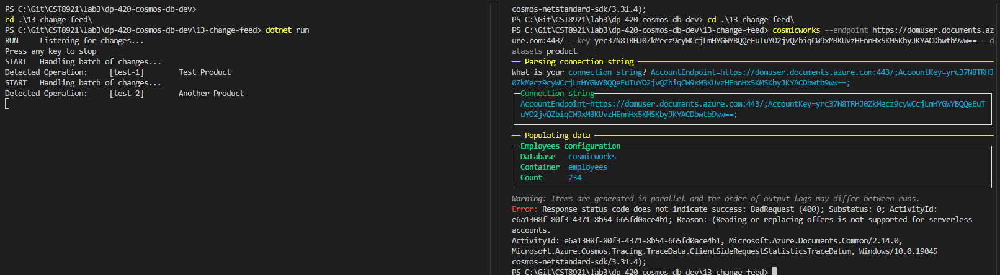

# 9. Create function app w/ configs
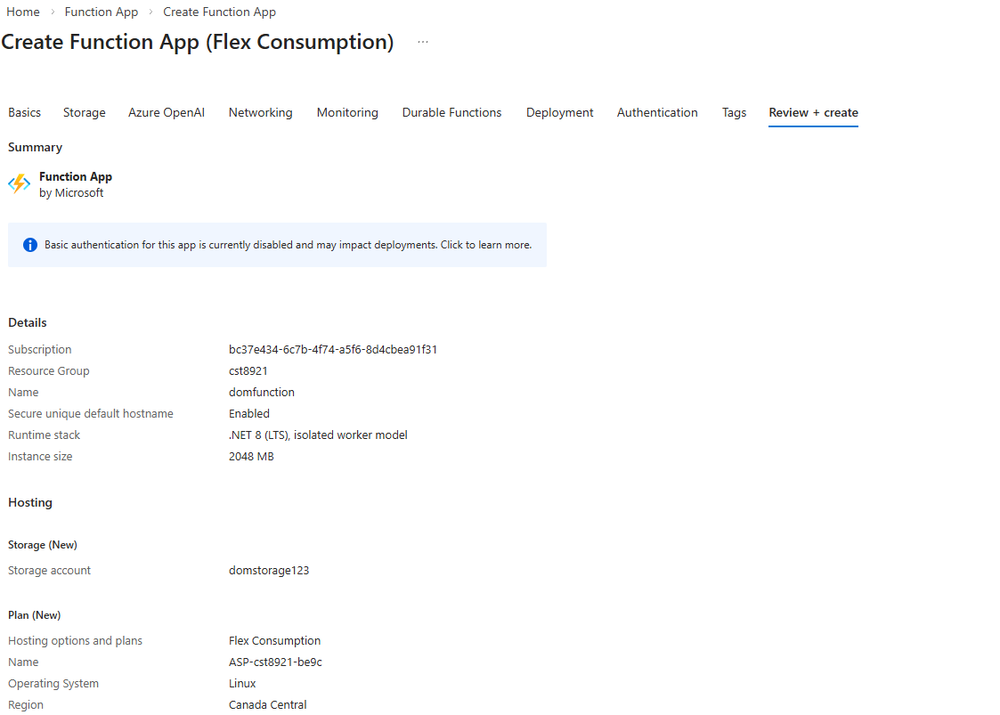

# 10.  Create azure function

function has been created, and triggers when updates happen
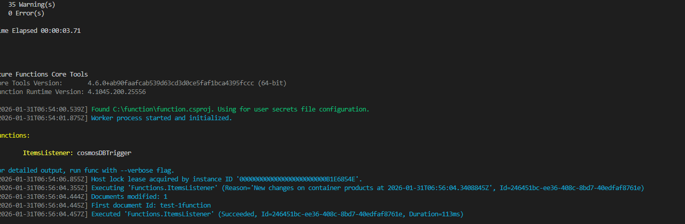

Updating this json, and it will trigger on vscode
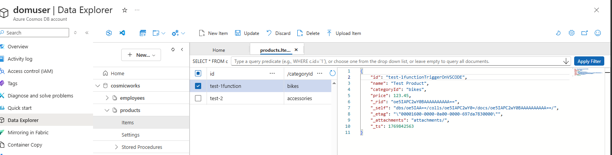

bottom message, "succeeded"
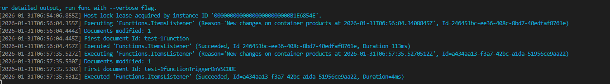

# Using cosmicwork endpoints and key won't work on serverless with out subscription, I have done all the steps besides those that aren't working.

# Delete everything
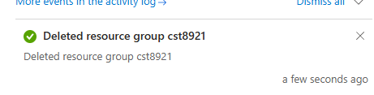
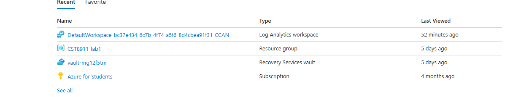
