### Dom Heallis 040728287
### Lab 4

# Step 1: Upload Data to Azure Data Lake 

created container named raw
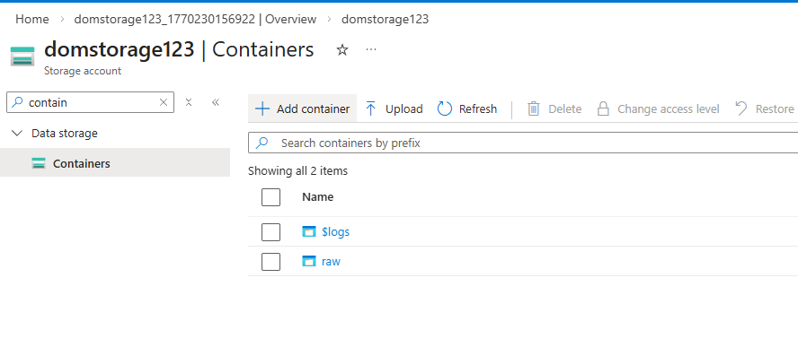

uploaded files into container
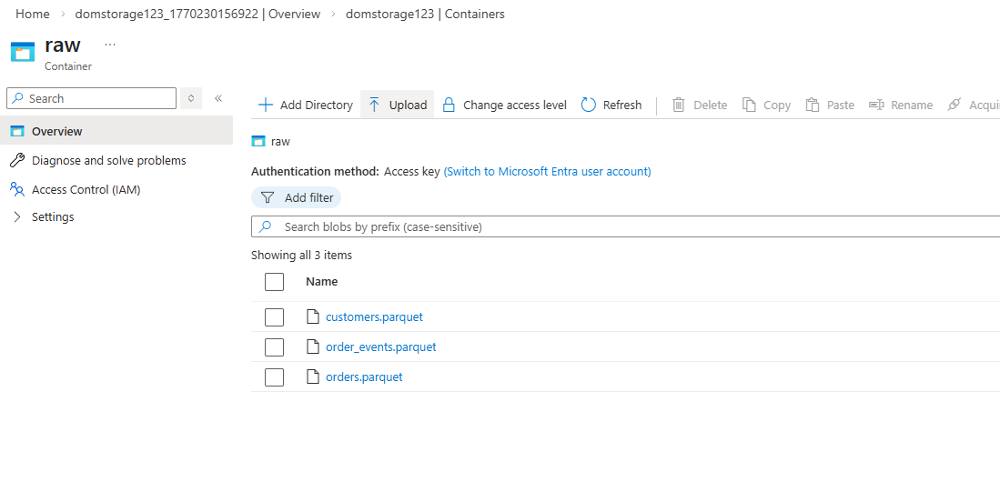

copied files into their appropriate directories
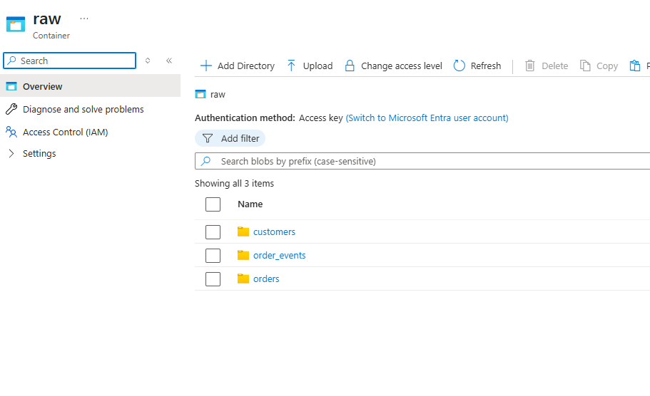

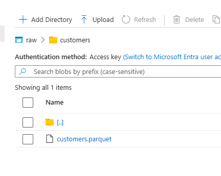
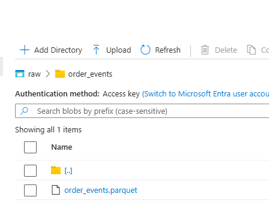
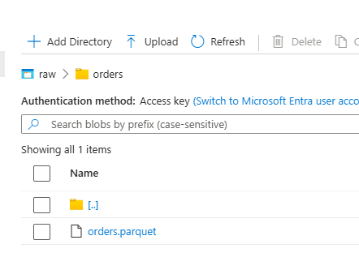

# Step 2: Explore Data using Serverless SQL

original script with files outside of directory
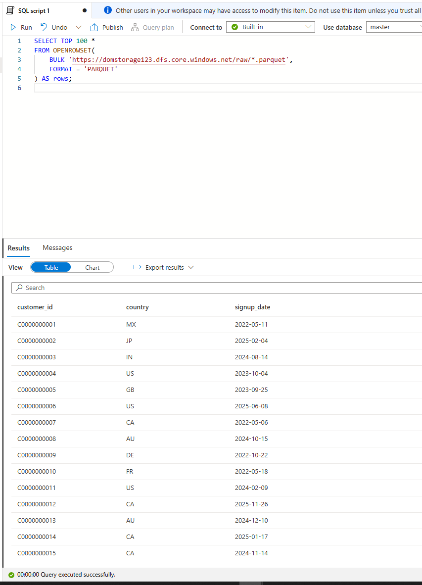

modified script because files are in folders
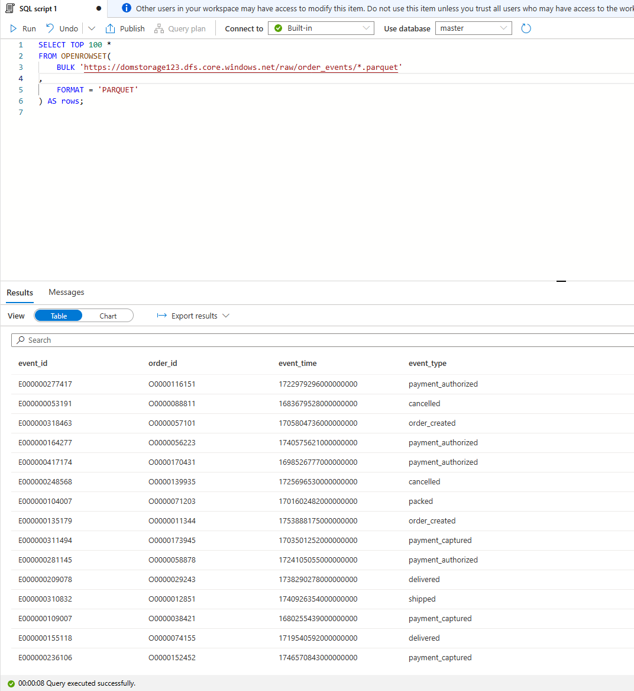

addingf a filer WHERE year > 2022
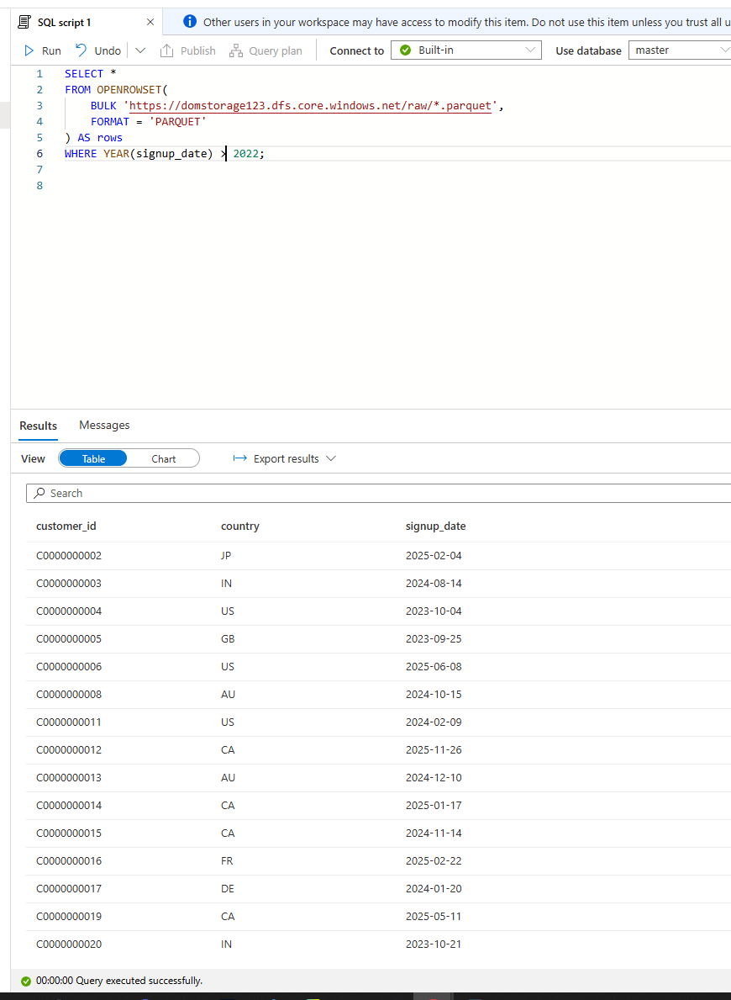

# Step 3: Explore Data using Spark Notebook

Fixed path by removing .parquet, and instead looked at specific files like customers
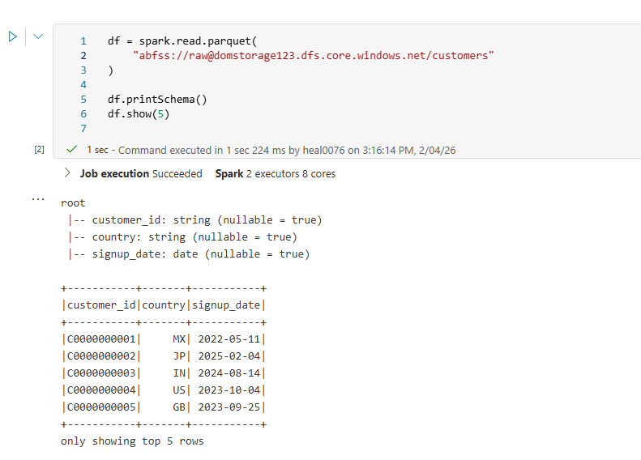

if i looked at all the .parquet files, it was giving me null answers. I think because each schema had different columns?
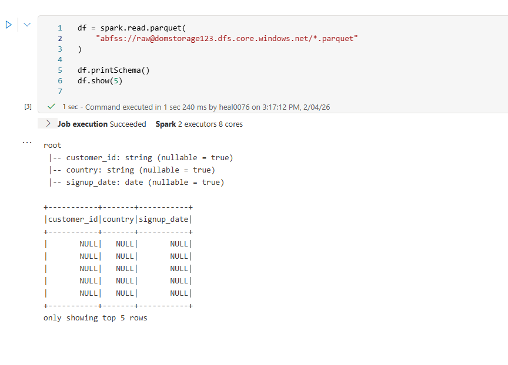

# step 4

Original row count
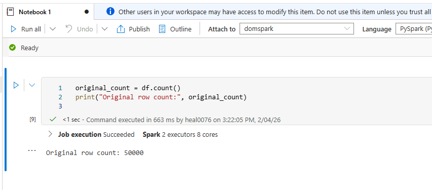

 removing duplicates
 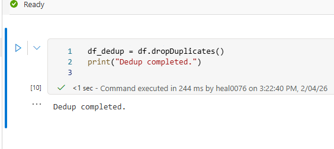

 function to make sure every customer id only appears once
 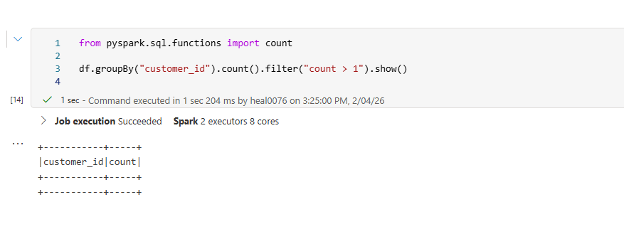

 # step 5

 using signup date instead of event_time for customers file
 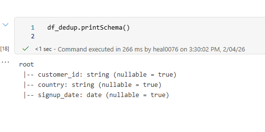

 # step 6

 Fixing data type, by seperating year and months
 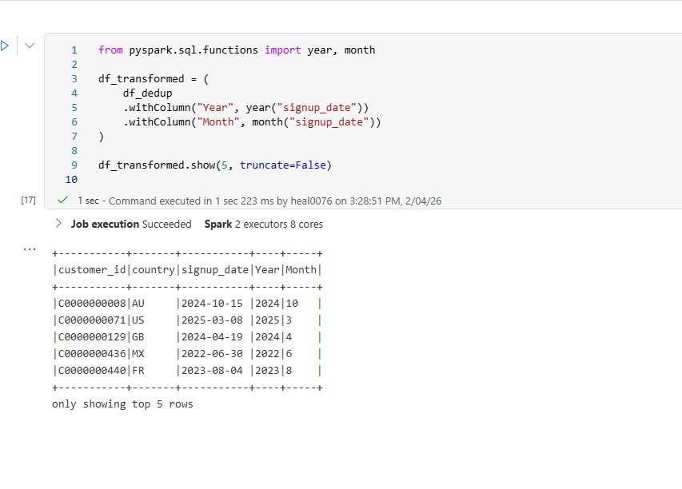

 # step 7

 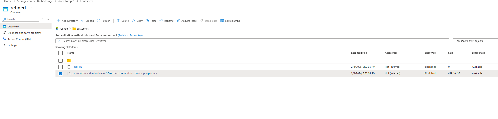

# step 8

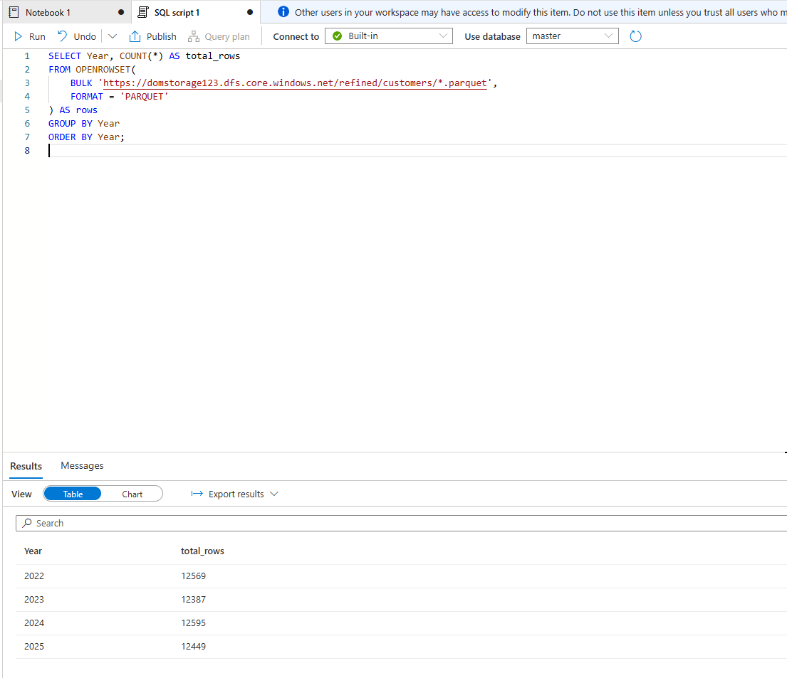

# Step 9: Analyze & Visualize Data 

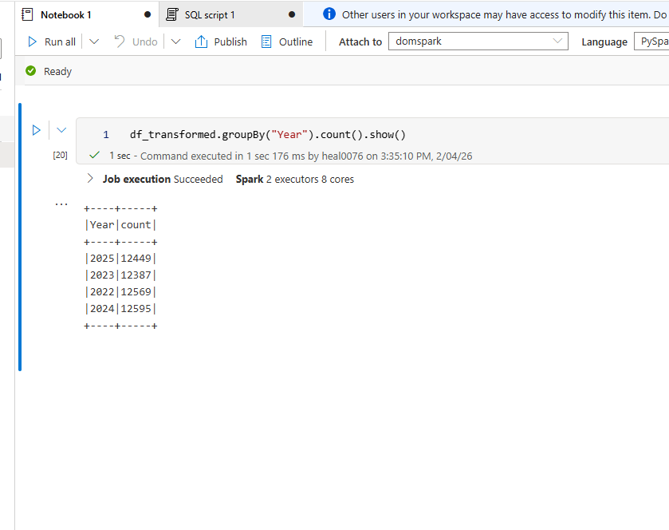

# step 10 delete everything

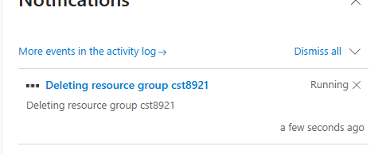

