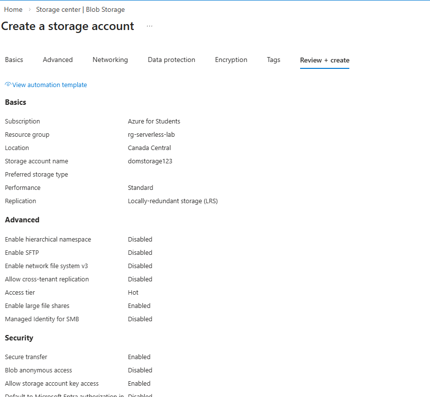
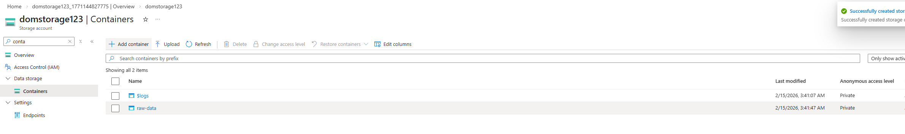
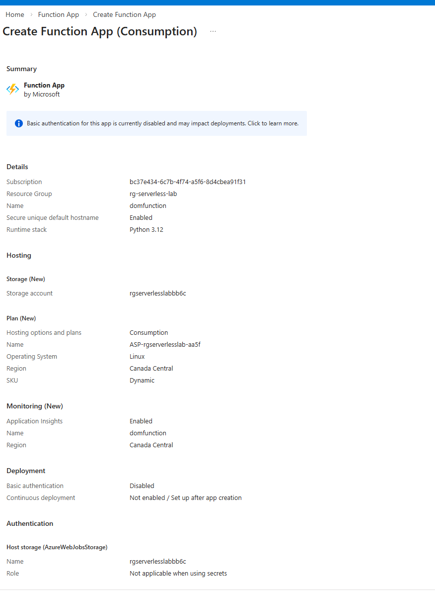
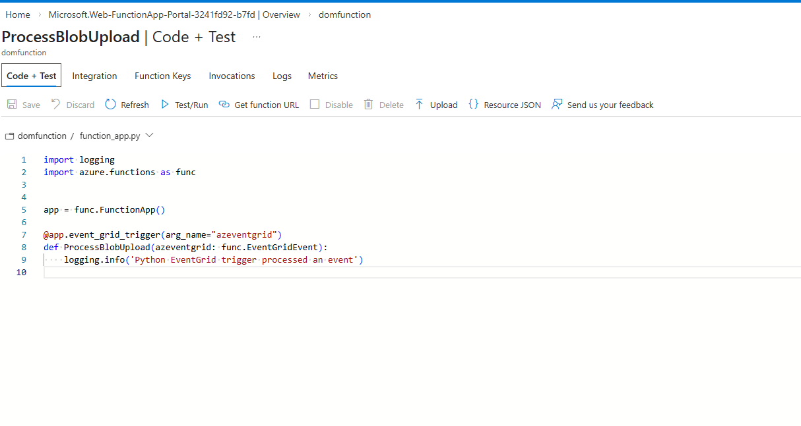
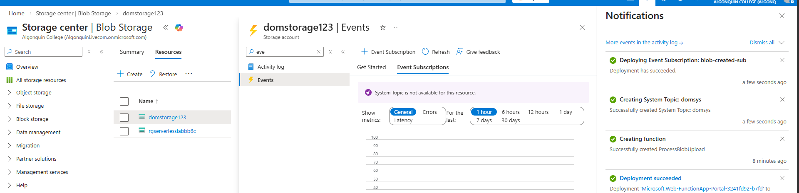
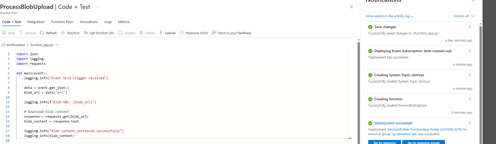
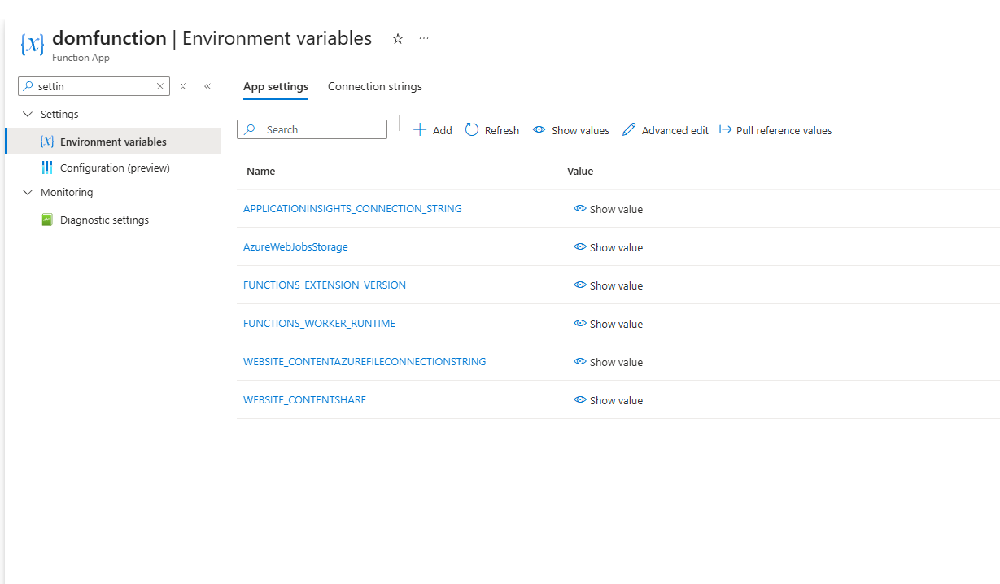
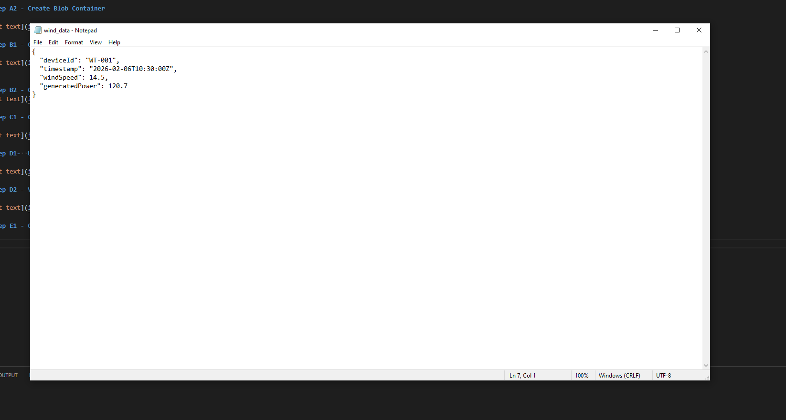
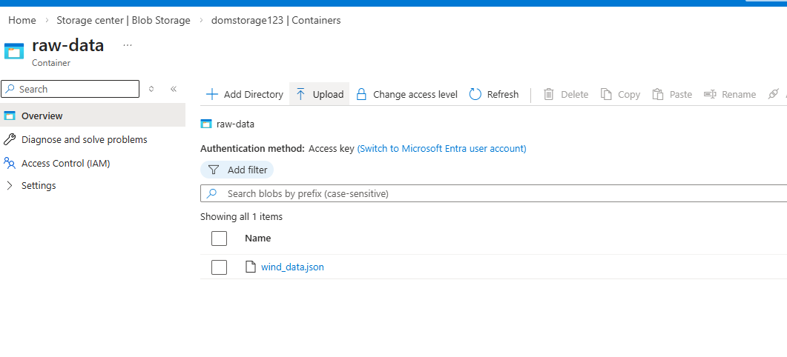
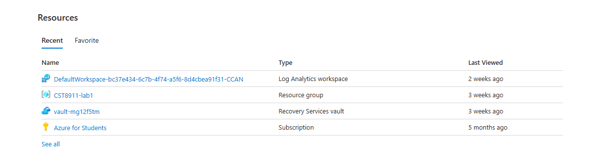

### Dom Heallis 040728287
### Lab 5

# Step A1 - Create Storage Account

# Step A2 - Create Blob Container

# Step B1 - Create Function App

# Step B2 - Create Function

# Step C1 - Create Event Subscription

# Step D1-  Update Function Code

# Step D2 - Verify Function Settings

# Step E1 - Create Sample Data File

# Step E2 - Upload File

# Delete everything

